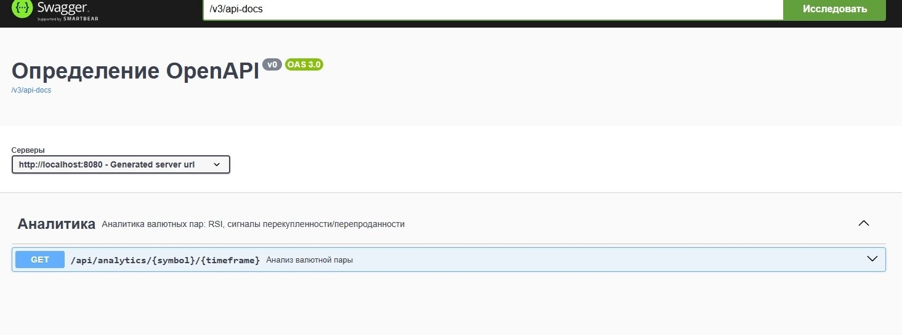
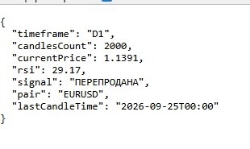
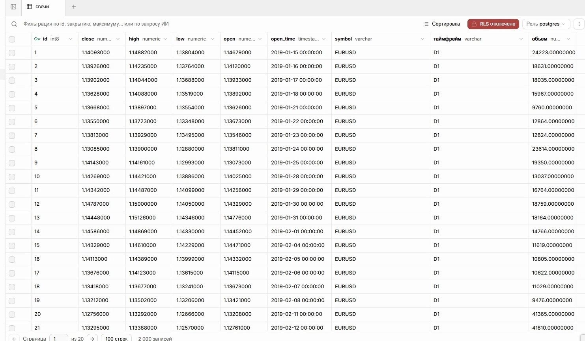

# Forex Analyzer

Spring Boot приложение для анализа валютных пар. Показывает RSI (индекс относительной силы), текущую цену и торговые сигналы перекупленности/перепроданности. Данные берутся из исторических свечей, загруженных из MetaTrader 5.

## Стек технологий

- **Java 21**
- **Spring Boot 4.0.8** (Web, Data JPA, Scheduling)
- **PostgreSQL** (в облаке Supabase)
- **ta4j 0.15** — библиотека технического анализа
- **Swagger / OpenAPI 3** — автодокументация API
- **Maven**

## Архитектура

```
Controller → Service → Repository → PostgreSQL
```

- **Controller** — REST API, принимает запросы.
- **Service** — бизнес-логика (расчёт RSI через ta4j).
- **Repository** — доступ к базе данных (Spring Data JPA).
- **PostgreSQL в Supabase** — хранение 2000+ исторических свечей.

## Эндпоинты

| Метод | URL | Описание |
|-------|-----|----------|
| GET | `/api/analytics/{symbol}/{timeframe}` | RSI + текущая цена + сигнал |

**Пример вызова:** `GET /api/analytics/EURUSD/D1`

## Пример ответа

```json
{
  "pair": "EURUSD",
  "timeframe": "D1",
  "candlesCount": 2000,
  "lastCandleTime": "2026-09-25T00:00",
  "currentPrice": 1.1391,
  "rsi": 29.17,
  "signal": "ПЕРЕПРОДАНА"
}
```

## Скриншоты

### Swagger UI


### Пример ответа API


### Данные в Supabase


## Как запустить

1. Клонировать репозиторий:
   ```
   git clone https://github.com/ENS21/forex_analyzer.git
   ```
2. Открыть в IntelliJ IDEA.
3. Настроить подключение к базе данных через переменные окружения:
    - `DB_URL` — JDBC-URL PostgreSQL (например, Supabase или локальный PostgreSQL)
    - `DB_USERNAME` — имя пользователя базы данных
    - `DB_PASSWORD` — пароль пользователя
4. Загрузить исторические свечи:
    - Экспортировать свечи из MetaTrader 5 в CSV-формат
    - Положить CSV-файл по пути, указанному в `CsvCandleLoader`
    - Запустить приложение `ForexAnalyzerApplication` — свечи загрузятся в базу автоматически
5. Открыть в браузере:
    - Swagger UI: `http://localhost:8080/swagger-ui.html`
    - API: `http://localhost:8080/api/analytics/EURUSD/D1`
   

   **Примечание:** 
   для работы приложения нужна база данных PostgreSQL и исторические данные из MetaTrader5. 
   Без них приложение запустится, но данные будут пустыми.


## Что реализовано

- ✅ Загрузка исторических свечей из MT5 (через CSV)
- ✅ Хранение свечей в PostgreSQL (Supabase)
- ✅ Расчёт RSI через ta4j
- ✅ REST API с автодокументацией Swagger
- ✅ Планировщик задач (`@Scheduled`) — заготовка для автоматизации

## Планы развития

- [ ] Автоматизация загрузки данных (MT5 + ZeroMQ / WebRequest)
- [ ] ATR — средний диапазон свечи (волатильность)
- [ ] Определение трендов (MA20 / MA50 / MA200)
- [ ] Статистика зон RSI (средняя просадка, длительность, % отскоков)
- [ ] Telegram-бот для уведомлений
- [ ] Мобильное приложение (Android)