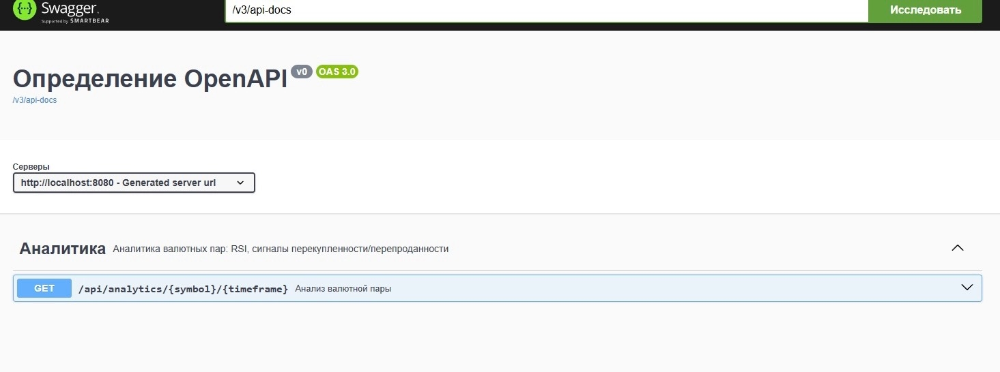
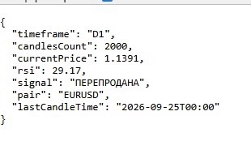
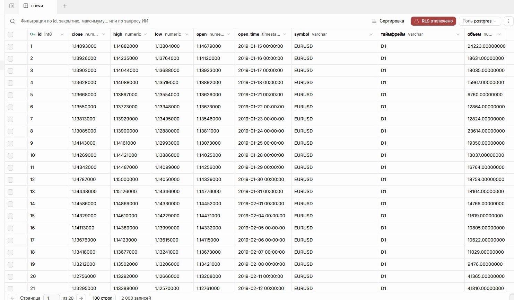

# Forex Analyzer

Spring Boot приложение для анализа валютных пар. Показывает RSI (индекс относительной силы), текущую цену и торговые сигналы перекупленности/перепроданности.

Данные поступают в реальном времени из **MetaTrader 5** через **ZeroMQ**.

## Стек технологий

- **Java 21**
- **Spring Boot 4.0.8** (Web, Data JPA, Scheduling)
- **PostgreSQL** (в облаке Supabase)
- **ta4j 0.15** — библиотека технического анализа
- **ZeroMQ (jeromq)** — приём тиков и свечей из MT5
- **Swagger / OpenAPI 3** — автодокументация API
- **Maven**

## Архитектура

```
MT5 (VPS) → MQL5-советник → ZeroMQ → Java (Spring Boot) → Supabase
                                              ↓
                                         REST API
                                              ↓
                                     Android / браузер
```

- **MQL5-советник** — отправляет тики и свечи по трём парам (EURUSD, GBPUSD, USDJPY) на двух таймфреймах (D1, H4).
- **`MT5CandleSubscriber`** — принимает свечи через ZeroMQ, сохраняет в базу.
- **`MT5TickSubscriber`** — принимает тики.
- **`AnalyticsService`** — считает RSI через ta4j.
- **`AnalyticsController`** — отдаёт REST API.
- **PostgreSQL (Supabase)** — хранение истории свечей.

# Forex Analyzer

Spring Boot приложение для анализа валютных пар. Показывает RSI (индекс относительной силы), текущую цену и торговые сигналы перекупленности/перепроданности.

Данные поступают в реальном времени из **MetaTrader 5** через **ZeroMQ**.

## Стек технологий

- **Java 21**
- **Spring Boot 4.0.8** (Web, Data JPA, Scheduling)
- **PostgreSQL** (в облаке Supabase)
- **ta4j 0.15** — библиотека технического анализа
- **ZeroMQ (jeromq)** — приём тиков и свечей из MT5
- **Swagger / OpenAPI 3** — автодокументация API
- **Maven**

## Архитектура

```
MT5 (VPS) → MQL5-советник → ZeroMQ → Java (Spring Boot) → Supabase
                                              ↓
                                         REST API
                                              ↓
                                     Android / браузер
```

- **MQL5-советник** — отправляет тики и свечи по трём парам (EURUSD, GBPUSD, USDJPY) на двух таймфреймах (D1, H4).
- **`MT5CandleSubscriber`** — принимает свечи через ZeroMQ, сохраняет в базу.
- **`MT5TickSubscriber`** — принимает тики.
- **`AnalyticsService`** — считает RSI через ta4j.
- **`AnalyticsController`** — отдаёт REST API.
- **PostgreSQL (Supabase)** — хранение истории свечей.

## Поддерживаемые пары и таймфреймы

| Пара | D1 | H4 |
|---|---|---|
| EURUSD | ✅ | ✅ |
| GBPUSD | ✅ | ✅ |
| USDJPY | ✅ | ✅ |

## Эндпоинты

| Метод | URL | Описание |
|-------|-----|----------|
| GET | `/api/analytics/{symbol}/{timeframe}` | RSI + текущая цена + сигнал |

# Forex Analyzer

Spring Boot приложение для анализа валютных пар. Показывает RSI (индекс относительной силы), текущую цену и торговые сигналы перекупленности/перепроданности.

Данные поступают в реальном времени из **MetaTrader 5** через **ZeroMQ**.

## Стек технологий

- **Java 21**
- **Spring Boot 4.0.8** (Web, Data JPA, Scheduling)
- **PostgreSQL** (в облаке Supabase)
- **ta4j 0.15** — библиотека технического анализа
- **ZeroMQ (jeromq)** — приём тиков и свечей из MT5
- **Swagger / OpenAPI 3** — автодокументация API
- **Maven**

## Архитектура

```
MT5 (VPS) → MQL5-советник → ZeroMQ → Java (Spring Boot) → Supabase
                                              ↓
                                         REST API
                                              ↓
                                     Android / браузер
```

- **MQL5-советник** — отправляет тики и свечи по трём парам (EURUSD, GBPUSD, USDJPY) на двух таймфреймах (D1, H4).
- **`MT5CandleSubscriber`** — принимает свечи через ZeroMQ, сохраняет в базу.
- **`MT5TickSubscriber`** — принимает тики.
- **`AnalyticsService`** — считает RSI через ta4j.
- **`AnalyticsController`** — отдаёт REST API.
- **PostgreSQL (Supabase)** — хранение истории свечей.

## Поддерживаемые пары и таймфреймы

| Пара | D1 | H4 |
|---|---|---|
| EURUSD | ✅ | ✅ |
| GBPUSD | ✅ | ✅ |
| USDJPY | ✅ | ✅ |

## Эндпоинты

| Метод | URL | Описание |
|-------|-----|----------|
| GET | `/api/analytics/{symbol}/{timeframe}` | RSI + текущая цена + сигнал |

**Примеры вызова:**
- `GET /api/analytics/EURUSD/D1`
- `GET /api/analytics/GBPUSD/H4`
- `GET /api/analytics/USDJPY/D1`

## Пример ответа

```json
{
  "pair": "GBPUSD",
  "timeframe": "D1",
  "candlesCount": 499,
  "currentPrice": 1.32365,
  "rsi": 42.66,
  "signal": "НЕЙТРАЛЬНО",
  "lastCandleTime": "2026-10-09T00:00"
}
```
## Live Demo

Приложение работает в реальном времени на VPS и доступно из интернета. Можно открыть в браузере или с телефона — без установки.

### Проверить RSI для трёх пар

| Пара | D1 (дневной) | H4 (четырёхчасовой) |
|------|--------------|---------------------|
| **EURUSD** | [Открыть](http://185.209.30.192:8080/api/analytics/EURUSD/D1) | [Открыть](http://185.209.30.192:8080/api/analytics/EURUSD/H4) |
| **GBPUSD** | [Открыть](http://185.209.30.192:8080/api/analytics/GBPUSD/D1) | [Открыть](http://185.209.30.192:8080/api/analytics/GBPUSD/H4) |
| **USDJPY** | [Открыть](http://185.209.30.192:8080/api/analytics/USDJPY/D1) | [Открыть](http://185.209.30.192:8080/api/analytics/USDJPY/H4) |

**Пример запроса:**
```
http://185.209.30.192:8080/api/analytics/GBPUSD/D1
```

**Что вернёт:**
```json
{
  "pair": "GBPUSD",
  "timeframe": "D1",
  "candlesCount": 499,
  "currentPrice": 1.32365,
  "rsi": 42.66,
  "signal": "НЕЙТРАЛЬНО",
  "lastCandleTime": "2026-10-09T00:00"
}
```

### Что работает «под капотом»

- **MT5 на VPS** (Москва) — источник данных, работает 24/7.
- **MQL5-советник** — отправляет тики и свечи через ZeroMQ.
- **Java-бэкенд** — запущен как Windows-служба, автоматически стартует при перезагрузке сервера.
- **Supabase** — облачное хранилище свечей.
- **Firebase Cloud Messaging** — готов к отправке push-уведомлений.

> **Примечание:** это демо-сервер. Если ссылки не открываются — возможно, идёт перезапуск или обновление. Напишите мне, и я проверю.

## Скриншоты

### Swagger UI


### Пример ответа API


### Данные в Supabase


## Как запустить

1. Клонировать репозиторий:
   ```
   git clone https://github.com/ENS21/forex_analyzer.git
   ```
2. Открыть в IntelliJ IDEA.
3. Настроить переменные окружения:
    - `DB_URL` — JDBC-URL базы данных
    - `DB_USERNAME` — имя пользователя
    - `DB_PASSWORD` — пароль
4. Запустить `ForexAnalyzerApplication`.
5. Открыть в браузере:
    - Swagger UI: `http://localhost:8080/swagger-ui.html`
    - API: `http://localhost:8080/api/analytics/EURUSD/D1`

**Примечание:** для получения реальных данных приложению нужен запущенный MQL5-советник, отправляющий свечи через ZeroMQ на порт 5555.

## Что реализовано

- ✅ Приём тиков из MT5 через ZeroMQ
- ✅ Приём свечей (D1, H4) из MT5 через ZeroMQ
- ✅ Хранение 2500+ свечей в PostgreSQL (Supabase)
- ✅ Поддержка трёх валютных пар: EURUSD, GBPUSD, USDJPY
- ✅ Расчёт RSI через ta4j
- ✅ REST API с автодокументацией Swagger
- ✅ Поддержка кириллицы в JSON-ответах (UTF-8)
- ✅ Запуск как Windows-служба на VPS

## Планы развития

- [ ] Push-уведомления (Firebase / MAX-бот)
- [ ] Уровни поддержки и сопротивления
- [ ] Статистика зон RSI (средняя просадка, длительность)
- [ ] Краткосрочный/среднесрочный/долгосрочный тренд (MA20/MA50/MA200)
- [ ] Мобильное приложение (Android)